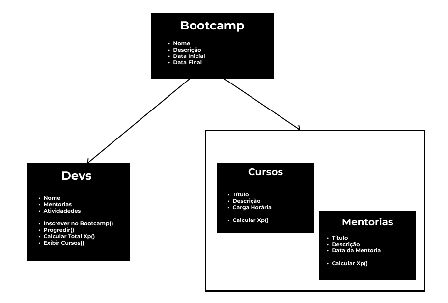

# Projeto - Abstraindo um Bootcamp Usando Orientação a Objetos em Java

## Domínio da Aplicação


## Diagrama de Classes
````mermaid
classDiagram
    class Bootcamp  {
        -String nome
        -String descricao
        -LocalDate dataInicial
        -LocalDate dataFinal
        -Set~Dev~ devsInscritos
        -Set~Conteudo~ conteudos
        
    }

    class Conteudo {
        <<Abstract>>
        -String titulo
        -String descricao
        +calcularXp() double
    }

    class Curso {
        -int cargaHoraria
        +calcularXp() double
    }
    
    class Mentoria {
        -LocalDate data
        +calcularXp() double
    }

    class Dev {
        -String nome
        -Set~Conteudo~ conteudosInscritos
        -Set~Conteudo~ conteudosConcluidos
        +inscreverBootcamp()
        +progredir()
        +calcularTotalXp() double
    }    

    Conteudo <|-- Curso : inherits
    Conteudo <|-- Mentoria : inherits

    Bootcamp o-- Dev : "devsInscritos"
    Bootcamp o-- Conteudo : "conteudos"
    Dev o-- Conteudo : "conteudosInscritos"
    Dev o-- Conteudo : "conteudosConcluidos"

````

## Tools 
- [gitignore.io](https://www.toptal.com/developers/gitignore/)

